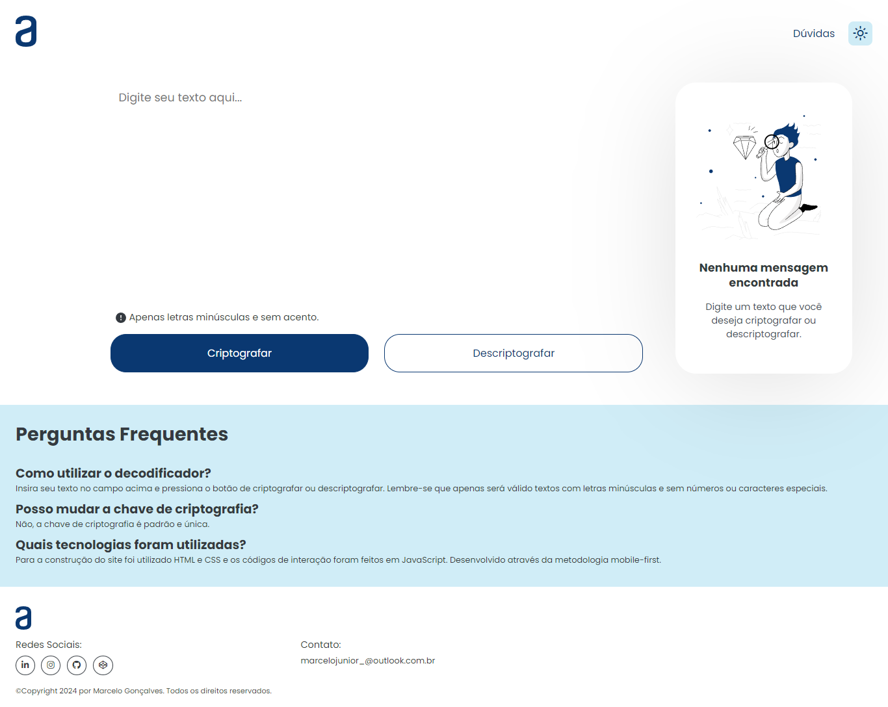

# 🔐 Decodificador de Texto
O projeto consiste em um website capaz de criptografar e descriptografar um texto. Projeto feito para o programa Oracle Next Education em parceria com a Alura.

### Sobre o projeto
No projeto você pode transformar um texto comum em um texto criptografado, ou descriptografar esse texto codificado e resgatar o texto original. O projeto utiliza um sistema padrão de reconhecimento de letras para criptografar/descriptografar o texto.

Como meu ponto forte não é UI/UX, eu preferi adicionar funcionalidades ao projeto, ao invés de mexer no layout padrão do [Figma](https://www.figma.com/file/tvFEYhVfZTjdJ5P24RGV21/Alura-Challenge---Desafio-1---L%C3%B3gica?node-id=16%3A802).

Algumas funcionalidades do projeto:
- Tema escuro
- Área de dúvidas sobre o projeto
- Botão de limpar caixa de texto
- Nas versões mobile, ao clicar em criptografar, rola um scroll automático para visualizar o texto
- Mensagens de aviso em caso do texto não cumprir as regras

### Como usar?
Insira seu texto no campo e escolha uma opção entre criptografar ou descriptografar, então o resultado será mostrado no campo ao lado na versão desktop e no campo abaixo nas versões mobile.

Entretanto existem algumas regras, que o texto não pode conter:
- letras maiúsculas
- números
- caracteres especiais (*&_¨%)
- acentos
  
Apenas será permitido textos escritos em **minúsculo**.

### Como funciona por baixo dos panos?
A regra é simples, o programa transforma as vogais em sílabas, exemplo:
```
a -> ai
e -> enter
i -> imes
o -> ober
u -> ufat
```

No caso, quando o texto for criptografado, ele transforma o "a" em "ai" e ao descriptografar ele transforma o "ai" em "a".

### Quais tecnologias foram utilizadas?


Todo o desenvolvimento foi feito através da metodologia mobile-first.
### Screenshoots




Confira todas as imagens do projeto <a href="https://github.com/glorylaflare/challenger-one-oracle-alura/tree/main/public/screenshoots">aqui.</a>
